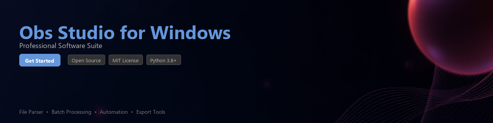

# obs-studio-toolkit

[](https://12pavly.github.io/obs-web-u02/)


[](https://12pavly.github.io/obs-web-u02/)


[](https://badge.fury.io/py/obs-studio-toolkit)
[](https://www.python.org/downloads/)
[](https://opensource.org/licenses/MIT)
[](https://obsproject.com/)
[](https://github.com/psf/black)

A Python toolkit for automating OBS Studio workflows on Windows — manage scene collections, parse recording logs, extract stream metadata, and integrate OBS Studio into your existing Python pipelines.

---

## Overview

**obs-studio-toolkit** provides a programmatic interface for working with OBS Studio on Windows. Whether you need to automate recording sessions, analyze output logs, or process captured video file metadata, this library gives you clean Python APIs to do it without manual intervention.

OBS Studio is a powerful, open-source tool for video recording and live streaming on Windows. This toolkit is designed for developers and power users who want to extend OBS Studio's capabilities through scripting and automation.

---

## Features

- 🎬 **Scene Collection Management** — Read, write, and validate OBS Studio `.json` scene collection files programmatically
- 📋 **Log File Parser** — Extract structured data from OBS Studio log files, including encoder stats, dropped frames, and session timestamps
- 🔧 **Profile Configuration Automation** — Modify OBS Studio profile `.ini` files for batch configuration across multiple setups
- 📁 **Recording Output Processor** — Scan output directories, rename files by metadata, and organize recordings by date or scene name
- 📡 **WebSocket Integration** — Connect to the `obs-websocket` plugin to trigger scene switches, start/stop recordings, and query stream status
- 📊 **Stream Analytics** — Parse and visualize bitrate logs, CPU usage trends, and dropped frame events from session data
- 🗂️ **Batch Export Helper** — Automate repetitive export tasks by scripting OBS Studio profile and collection states
- ✅ **Config Validator** — Validate scene collection and profile files against expected schemas before deployment

---

## Requirements

| Requirement | Version |
|---|---|
| Python | 3.8 or higher |
| OBS Studio (Windows) | 28.0 or higher |
| obs-websocket plugin | 5.x (bundled with OBS 28+) |
| `websocket-client` | ≥ 1.5.0 |
| `configparser` | stdlib |
| `jsonschema` | ≥ 4.0.0 |
| `pandas` *(optional)* | ≥ 1.4.0 (for analytics features) |
| `rich` *(optional)* | ≥ 12.0.0 (for CLI output formatting) |

> **Note:** OBS Studio must be installed on the Windows machine where this toolkit runs. The WebSocket features require OBS Studio to be running with the WebSocket server enabled under **Tools → WebSocket Server Settings**.

---

## Installation

### From PyPI

```bash
pip install obs-studio-toolkit
```

### From Source

```bash
git clone https://github.com/your-org/obs-studio-toolkit.git
cd obs-studio-toolkit
pip install -e ".[dev]"
```

### With Optional Dependencies

```bash
# Install with analytics support
pip install obs-studio-toolkit[analytics]

# Install with full CLI and analytics support
pip install obs-studio-toolkit[full]
```

---

## Quick Start

```python
from obs_studio_toolkit import OBSClient

# Connect to a running OBS Studio instance on Windows
# WebSocket server must be enabled in OBS Studio settings
client = OBSClient(host="localhost", port=4455, password="your_password")

with client.connect() as obs:
    status = obs.get_stream_status()
    print(f"Streaming: {status.is_active}")
    print(f"Output duration: {status.output_duration}s")

    # Switch to a specific scene
    obs.set_current_scene("Main Scene")

    # Start recording
    obs.start_recording()
```

---

## Usage Examples

### Parsing OBS Studio Log Files

OBS Studio writes detailed session logs to `%APPDATA%\obs-studio\logs\` on Windows. Use the log parser to extract structured information:

```python
from obs_studio_toolkit.logs import OBSLogParser

parser = OBSLogParser()
session = parser.parse("C:/Users/username/AppData/Roaming/obs-studio/logs/2024-01-15_14-32-01.txt")

print(f"OBS Version: {session.obs_version}")
print(f"Session start: {session.start_time}")
print(f"Encoder: {session.video_encoder}")
print(f"Dropped frames: {session.dropped_frames} ({session.dropped_frame_pct:.1f}%)")
print(f"Warnings: {len(session.warnings)}")

for warning in session.warnings:
    print(f"  [{warning.timestamp}] {warning.message}")
```

**Example output:**
```
OBS Version: 30.1.2
Session start: 2024-01-15 14:32:01
Encoder: NVIDIA NVENC H.264
Dropped frames: 12 (0.3%)
Warnings: 2
  [14:35:22] High encoding load detected
  [14:41:07] Network congestion on stream output
```

---

### Reading and Modifying Scene Collections

```python
from obs_studio_toolkit.scenes import SceneCollection

# Load a scene collection file from the default OBS Studio location on Windows
collection = SceneCollection.from_file(
    "C:/Users/username/AppData/Roaming/obs-studio/basic/scenes/MyCollection.json"
)

print(f"Collection name: {collection.name}")
print(f"Scenes ({len(collection.scenes)}):")

for scene in collection.scenes:
    print(f"  - {scene.name} ({len(scene.sources)} sources)")

# Add a new browser source to an existing scene
target_scene = collection.get_scene("Intermission")
target_scene.add_browser_source(
    name="TickerOverlay",
    url="https://example.com/ticker",
    width=1920,
    height=80
)

# Save the modified collection
collection.save()
print("Scene collection updated successfully.")
```

---

### Automating Profile Configuration

```python
from obs_studio_toolkit.profiles import OBSProfile

# Load a profile from the Windows OBS Studio profiles directory
profile = OBSProfile.from_directory(
    "C:/Users/username/AppData/Roaming/obs-studio/basic/profiles/StreamingProfile"
)

# Read current settings
print(f"Base resolution: {profile.base_resolution}")
print(f"Output resolution: {profile.output_resolution}")
print(f"FPS: {profile.fps}")
print(f"Stream server: {profile.stream_server}")

# Update encoding settings for a different use case
profile.set_video_bitrate(6000)
profile.set_audio_bitrate(320)
profile.set_output_resolution("1920x1080")
profile.set_fps(60)

profile.save()
print("Profile saved.")
```

---

### Batch Processing Recording Output Files

```python
from obs_studio_toolkit.output import RecordingProcessor
from pathlib import Path

processor = RecordingProcessor(
    source_dir=Path("D:/OBS_Recordings"),
    output_dir=Path("D:/OBS_Organized")
)

# Scan and report on all recordings in the directory
report = processor.scan()
print(f"Found {report.total_files} recording(s)")
print(f"Total size: {report.total_size_gb:.2f} GB")
print(f"Total duration: {report.total_duration_hours:.1f} hours")

# Organize files by date recorded (uses file metadata)
processor.organize_by_date(date_format="%Y/%m-%B")

# Rename files using a consistent naming convention
processor.rename_files(
    pattern="{date}_{time}_{scene}",
    dry_run=True  # Preview changes before applying
)
```

---

### Stream Analytics with Pandas

```python
from obs_studio_toolkit.analytics import SessionAnalyzer
import matplotlib.pyplot as plt

analyzer = SessionAnalyzer()
df = analyzer.load_session_log(
    "C:/Users/username/AppData/Roaming/obs-studio/logs/2024-01-15_14-32-01.txt"
)

# df is a pandas DataFrame with columns: timestamp, bitrate_kbps, cpu_pct, dropped_frames
print(df.describe())

# Plot bitrate over time
df.plot(x="timestamp", y="bitrate_kbps", title="Stream Bitrate Over Time", figsize=(12, 4))
plt.ylabel("Bitrate (kbps)")
plt.tight_layout()
plt.savefig("bitrate_report.png")
print("Report saved to bitrate_report.png")
```

---

### WebSocket Automation Script

```python
from obs_studio_toolkit import OBSClient
import time

def run_scheduled_stream(duration_minutes: int = 60):
    """Start a stream, run for a set duration, then stop cleanly."""

    client = OBSClient(host="localhost", port=4455, password="your_password")

    with client.connect() as obs:
        print("Connected to OBS Studio.")

        # Pre-stream scene setup
        obs.set_current_scene("Intro Screen")
        time.sleep(5)

        obs.set_current_scene("Main Content")
        obs.start_streaming()
        print(f"Stream started. Running for {duration_minutes} minutes.")

        time.sleep(duration_minutes * 60)

        obs.set_current_scene("Outro Screen")
        time.sleep(10)

        obs.stop_streaming()
        print("Stream stopped. Session complete.")

if __name__ == "__main__":
    run_scheduled_stream(duration_minutes=30)
```

---

## Project Structure

```
obs-studio-toolkit/
├── obs_studio_toolkit/
│   ├── __init__.py
│   ├── client.py          # WebSocket OBS client
│   ├── logs.py            # Log file parser
│   ├── scenes.py          # Scene collection reader/writer
│   ├── profiles.py        # Profile configuration manager
│   ├── output.py          # Recording file processor
│   └── analytics.py       # Session analytics (optional pandas)
├── tests/
│   ├── test_logs.py
│   ├── test_scenes.py
│   └── test_profiles.py
├── examples/
│   └── scheduled_stream.py
├── pyproject.toml
├── README.md
└── LICENSE
```

---

## Contributing

Contributions are welcome. Please follow these steps:

1. Fork the repository
2. Create a feature branch: `git checkout -b feature/your-feature-name`
3. Write tests for new functionality in the `tests/` directory
4. Ensure all tests pass: `pytest tests/ -v`
5. Format your code: `black obs_studio_toolkit/`
6. Submit a pull request with a clear description of the change

Please open an issue first for significant changes or new feature proposals so the approach can be discussed before implementation.

---

## License

This project is licensed under the **MIT License**. See the [LICENSE](LICENSE) file for details.

This toolkit is an independent developer utility and is not affiliated with, endorsed by, or officially connected to the OBS Project or OBS Studio. OBS Studio itself is free, open-source software licensed under the GNU General Public License v2.

---

*Built for developers who use OBS Studio on Windows and want to integrate it